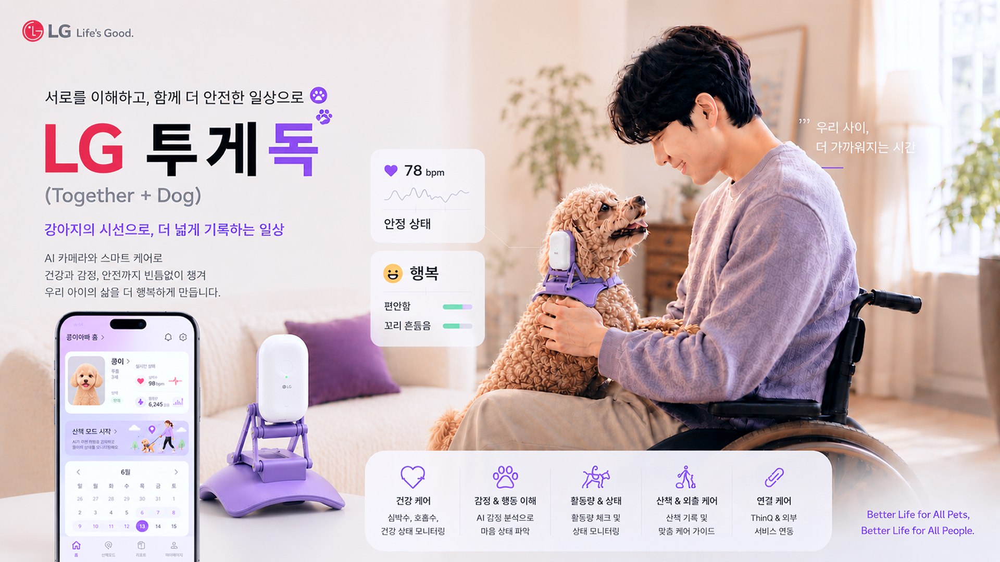
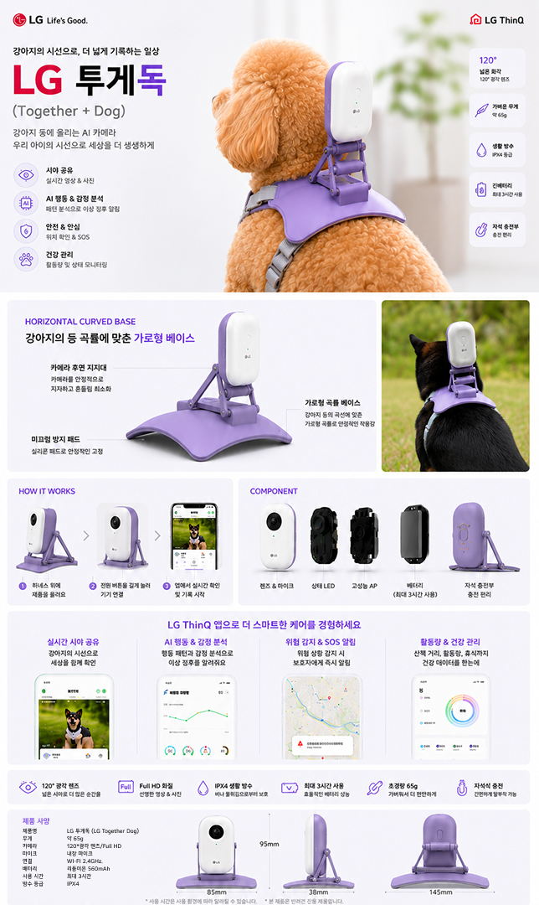
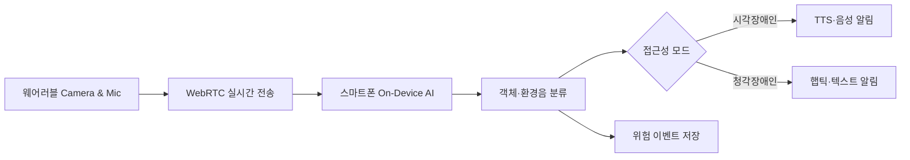
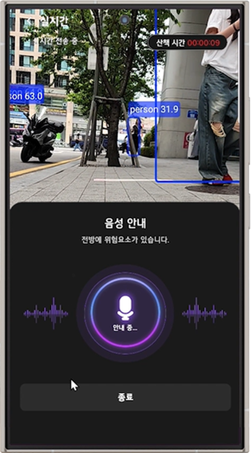
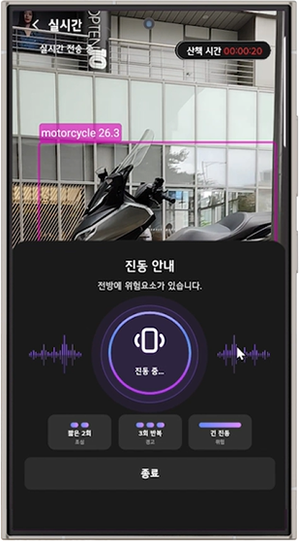

# TogeDog 🐕‍🦺

> 서로를 이해하고, 함께 더 안전한 일상으로<br>
> **장애인과 반려견을 위한 양방향 스마트 케어 서비스**


<!-- IMAGE: 프로젝트 메인 커버 이미지 삽입
추천 파일명: assets/images/cover.png
내용: 휠체어를 사용하는 보호자와 반려견이 함께 있는 TogeDog 대표 이미지
-->

---

## 1. 프로젝트 개요

| 구분 | 내용 |
|---|---|
| 프로젝트명 | TogeDog |
| 팀명 | R3PLAY |
| 교육 과정 | 2026년 K-Digital Training 디지털 선도기업 아카데미, LG전자 DX School 실전역량 프로젝트 |
| 프로젝트 유형 | LG전자 주제 |
| 주제 | 장애인과 반려견을 위한 양방향 스마트 케어 서비스 |
| 프로젝트 기간 | 2026.05.19–2026.06.25 |
| 최종 산출일 | 2026.06.25 |
| 팀장 | 김예원 |
| 팀원 | 김주영, 김채원, 신채연, 황병관 |
| 핵심 타깃 | 일반 반려견을 양육하는 시각·청각장애인 보호자 |
| 핵심 솔루션 | AI 웨어러블 기기와 LG ThinQ 앱을 연동해 보호자의 이동 안전과 반려견의 건강을 함께 관리 |


### 프로젝트 한 줄 정의

**TogeDog은 장애인 반려인이 놓치기 쉬운 반려견의 위험 신호와 주변 환경 정보를 AI로 감지하고, 사용자의 장애 특성에 맞는 음성·진동·텍스트 방식으로 전달하는 접근성 기반 펫케어 서비스입니다.**

### 고객 감동 목표

> 웨어러블 AI 기기를 통해 보호자의 이동과 반려견의 건강을 함께 케어하는 경험을 제공한다.

### 개발 저장소

| 저장소 | 주요 내용 |
|---|---|
| [`togedog-mobile`](https://github.com/LG-TogeDog-Project/togedog-mobile) | 보호자용 Flutter 앱, 접근성 UI, 실시간 영상 수신, TTS·진동·텍스트 안내 |
| [`togedog-camera`](https://github.com/LG-TogeDog-Project/togedog-camera) | 반려견 측 Flutter 카메라·영상 송신 프로토타입 |
| [`togedog-backend`](https://github.com/LG-TogeDog-Project/togedog-backend) | FastAPI, Firebase·Memory Repository, REST API, WebSocket 이벤트 |
| [`togedog-ai`](https://github.com/LG-TogeDog-Project/togedog-ai) | YOLO 데이터 통합·학습 노트북과 평가 결과 |
| [`togedog-docs`](https://github.com/LG-TogeDog-Project/togedog-docs) | 시스템 아키텍처, API 명세, DB 설계와 저장소 연결 구조 |


---

## 2. 추진 배경

### 2.1 펫테크 시장의 성장

펫테크는 반려동물 산업에 사물인터넷, 인공지능, 빅데이터 등 첨단 ICT 기술을 결합한 산업입니다. 반려동물을 단순히 양육하는 것을 넘어 반려동물의 상태를 실시간으로 모니터링하고, 데이터를 기반으로 건강과 행동을 관리하려는 수요가 빠르게 증가하고 있습니다.


### 2.2 장애인 보조견 수요 증가

시각·청각·지체장애인 등 보조견이 필요한 장애인은 증가하고 있지만, 훈련사 수와 양성 기관의 공급은 수요를 따라가지 못하고 있습니다. 장애 유형에 맞는 보조견을 양성해 온 기관 역시 예산 부족과 재정난을 겪고 있어 보조견을 필요로 하는 사람 모두가 지원받기 어렵습니다.

공식 안내견·도우미견은 분양까지 최소 1~2년의 대기 기간이 필요하며, 관련 비용 역시 높습니다. 실제 안내견·보조견 분양률은 신청자의 약 20.8%로, 나머지 약 80%의 장애인 가정은 일반 반려견과 생활하면서 충분한 보조를 받지 못하는 돌봄 사각지대에 놓여 있습니다.


### 2.3 LG가 이 문제를 해결해야 하는 이유

LG전자는 이미 다음과 같은 기술과 사업 역량을 보유하고 있습니다.

- AeroCatTower, AeroBooster, 세탁기 Pet Care Cycle 등 반려동물 친화 제품 연구·출시 경험
- LG ThinQ 기반의 반려동물 데이터 및 스마트홈 서비스 운영 경험
- 음성 안내, 컴포트 키트, 수어 상담, 촉각 스티커, 접근성 자문단 등 장애인 접근성 개선 경험
- 장애인·시니어 고객을 위한 Bold Move 프로젝트 운영
- 장애인 키오스크와 멀티모달 알림 기술
- LG 베스트샵 및 케어솔루션 오프라인 네트워크
- `Better Life for All`이라는 ESG 비전
- 가전 기업을 넘어 고객의 생활 경험을 연결하는 스마트 라이프 솔루션 기업으로의 확장 전략

그러나 장애인과 반려견이라는 특수 고객군을 대상으로 이동 안전, 건강 관리, 접근성 지원을 통합 제공하는 맞춤형 생활 솔루션은 아직 부족합니다.


### 2.4 장애인과 반려견의 연결성

장애인에게 반려견은 단순한 동물이 아니라 정서적 안정과 일상을 함께하는 가족입니다.

- 장애인 가구의 반려동물 양육률: 7.7%
- 일반 가구의 반려동물 양육률: 29.2%
- 장애인이 반려동물을 키우는 이유
  - 반갑게 대해주어 외롭지 않음: 55.4%
  - 가족 분위기 향상: 17.7%
  - 삶의 의욕: 6.3%
  - 여가 활동: 6.2%

장애인의 반려동물 양육률은 일반 가구보다 낮지만, 반려견이 장애인의 삶에 미치는 정서적 영향은 큽니다. 장애인은 비장애인과 같은 이유로 반려견을 가족으로 맞이하면서도, 신체적·감각적 제약으로 인해 반려견의 안전과 케어에 대한 추가적인 불안을 경험합니다.


### 2.5 VOC 워드클라우드 조사

Reddit, 유튜브 등에서 장애인과 반려견 관련 데이터를 조사한 결과 다음과 같은 관심사가 나타났습니다.

- 정서적 유대: 친구, 행복, 가족, 도움
- 케어 우려: 문제, 사고, 지원, 건강

즉, 장애인에게 반려견은 정서적으로 중요한 존재이지만, 반려견을 충분히 보호할 수 있는지에 대한 걱정이 동시에 존재합니다.

---

## 3. 문제 정의

### 3.1 핵심 문제

> 장애인과 반려견은 서로에게 중요한 존재이지만, 감각 정보의 단절로 인해 서로를 충분히 보호하기 어렵다.

위험 신호 인지가 늦어지면 위기 대응 역시 지연되고, 보호자와 반려견 모두에게 안전 공백이 발생합니다.

### 3.2 장애 유형별 문제

#### 시각의 단절: 시각장애인

반려견이 먹어서는 안 되는 음식이나 위험 물질에 접근하거나, 산책 중 차량·계단·장애물 등이 나타나도 상황을 즉시 시각적으로 확인하기 어렵습니다.

예시:

- 초콜릿 등 이물질 섭취 위험을 늦게 발견
- 산책 중 깨진 유리나 장애물 인지 지연
- 반려견이 갑자기 멈추거나 방향을 바꾼 이유를 파악하기 어려움

#### 청각의 단절: 청각장애인

반려견의 짖음, 낑낑거림, 경고성 소리나 차량 경적·사이렌 등 청각 기반의 위험 신호를 즉시 인지하기 어렵습니다.

예시:

- 경고 짖음의 발생 여부와 맥락을 놓침
- 반려견의 불안·통증 신호를 늦게 파악
- 주변 차량이나 위험 상황 대응 지연


### 3.3 SWOT 분석

| 구분 | 내용 |
|---|---|
| Strength | 반려동물 친화 제품 연구·출시 경험, ThinQ 멀티모달 알림 인프라, 장애인 키오스크 기술, LG 베스트샵·케어솔루션 네트워크, 접근성 기술과 펫케어 경험 |
| Weakness | 장애인 반려인 데이터 부족, 웨어러블 하드웨어 개발 경험 부족, 펫테크 도메인 전문성 부족, 반려동물 생체 데이터 부족, ThinQ 내 장애인 특화 서비스 부재, 수익모델 불명확 |
| Opportunity | 고령 장애인 증가, 반려동물 시장 성장, 삼성화재 안내견학교·KODDI 등 협력 가능 기관, 접근성·ESG 과제 확대, 스마트홈·원격 돌봄 수요 증가 |
| Threat | 기존 펫테크 경쟁 심화, 작은 초기 타깃 시장, 기기 비용 부담, 장애인 반려인 시장 데이터 부족, 웨어러블의 낮은 지속 사용률 |

### 3.4 전략적 확장 방향

#### SO 전략

장애인 증가와 반려동물 시장 성장이라는 두 흐름이 동시에 확대되는 상황에서 LG의 ThinQ 인프라와 하드웨어 제조 역량을 활용해 경쟁자가 진입하지 못한 교차시장을 선점합니다.

#### WO 전략

기존 펫 웨어러블은 비장애인 보호자를 기본 사용자로 가정합니다. LG의 접근성 기술과 ThinQ 인프라를 결합하면 장애인 반려인을 위한 펫케어라는 비어 있는 시장을 선점할 수 있습니다.

> LG는 펫케어와 장애인을 연결하는 새로운 시장으로 확장해야 한다.

---

## 4. 고객 정의

### 4.1 타깃 선정 근거

반려동물을 키우는 장애인 가정이 적은 이유는 단순히 경제적 여건이나 신체적 제약 때문만이 아닙니다. 실제로는 **반려동물을 제대로 돌볼 엄두가 나지 않아 입양을 주저하는 심리적 장벽**이 큽니다.

반면 반려견을 통해 정서적 안정과 삶의 질 향상을 얻고자 하는 니즈는 분명히 존재합니다. 따라서 일반 반려견과 생활하는 장애인 보호자가 반려견과 안전하게 독립 생활을 할 수 있도록 지원하는 기술이 필요합니다.

### 4.2 장애인 증가 추이

자료에서는 시각·청각·발달장애인 수가 과거 대비 각각 증가한 것으로 분석했습니다.

- 시각장애인: 8.94% 증가
- 청각장애인: 85.66% 증가
- 발달장애인: 60.8% 증가

장애인과 반려견의 삶의 질 향상과 안전한 동행을 위해 새로운 기술 기반 맞춤형 펫케어 서비스가 필요한 시점입니다.

### 4.3 확장 가능한 고객군

| 고객군 | 특징 | 대표 사용자 |
|---|---|---|
| 일반 반려인 확장형 | 야간 산책 비중이 높고 안전 관리에 관심이 많으며 스마트 디바이스에 익숙함 | 2030 얼리어답터 반려인, 야간 산책을 주로 하는 직장인 |
| 반려견 건강 관리형 | 활동량, 심박수, 스트레스와 이상 행동 등 예방 중심 관리 니즈가 높음 | 노령견·만성질환견 보호자, 고관여 보호자 |
| 독립 생활 지원형 | 자동화·원격 케어 기능을 선호하며 돌발 상황 대응 부담과 돌봄 피로가 큼 | 1인 가구 지체장애인, 반려견과 단둘이 사는 노약자 |
| 실시간 위험 인지형 | 시각·청각 제약으로 외출 시 돌발 상황과 반려견 경고 행동을 빠르게 파악하기 어려움 | 일반 반려견을 양육하는 시각·청각장애인 |

핵심 타깃은 **일반 반려견을 양육하는 시각·청각장애인**으로 선정했습니다.

---

## 5. 데이터 수집 및 분석 전략

### 5.1 데이터 수집

Reddit, 네이버 카페, 유튜브에서 장애인·반려견 관련 VOC를 수집했습니다.

| 출처 | 주요 키워드 | 선정 이유 | 수집 건수 |
|---|---|---|---:|
| Reddit | disability, blind, deaf, alone, danger, emergency, help, anxiety, alert, dog, service dog, pet care | 다양한 국가와 문화권의 실제 경험을 확보할 수 있어 요구사항 도출에 적합 | 106,554 |
| 네이버 카페 | 장애인, 불편, 소통, 안내견, 산책, 케어, 위험 감지, 짖음 | 국내 생활 환경과 산책·건강관리 경험이 반영된 생활 밀착형 데이터 확보 | 네이버 카페·유튜브 합산 42,611 |
| 유튜브 | 장애인, 불편, 소통, 안내견, 산책, 케어, 위험 감지, 짖음 | 영상과 댓글을 통해 실제 상황과 사용자의 불편을 함께 파악 | 네이버 카페·유튜브 합산 42,611 |

총 수집 데이터는 **149,165건**입니다.


### 5.2 전처리 및 필터링

#### 영어 데이터

```text
106,554건
→ 광고·스팸 제거: 102,124건
→ 영어 필터링·정규화: 99,910건
→ 특수문자 및 불필요 데이터 제거
→ 최종 98,587건
```

#### 한국어 데이터

```text
42,611건
→ 중복 제거: 41,979건
→ 한국어 필터링·정규화
→ 특수문자 및 URL 제거
→ 6글자 이하 단문 제거
→ 최종 40,152건
```

최종적으로 분석에 투입한 데이터는 **138,739건**입니다.


### 5.3 모델 선정

초기에는 `Okt + Doc2Vec + LDA` 방식으로 토픽 모델링을 수행했습니다. 그러나 일부 토픽이 중심에 밀집되어 경계가 모호했고, 같은 단어가 다른 상황에서 사용되는 맥락을 충분히 구분하기 어려웠습니다.

이를 개선하기 위해 다음과 같이 모델을 교체했습니다.

- 문장 임베딩: Sentence-BERT
- 영어 임베딩 모델: `all-MiniLM-L6-v2`
- 한국어 특화 Sentence-BERT 모델
- 토픽 모델링: BERTopic

Sentence-BERT는 문장을 의미 벡터로 변환하고, BERTopic은 단순 단어 빈도가 아니라 문맥적 유사성을 바탕으로 문서를 군집화합니다. 이를 통해 “왜 산책이 어려운지”, “반려견이 어떤 상황에서 짖는지”와 같은 행동과 경험 맥락을 더 세밀하게 분류할 수 있었습니다.


---

## 6. 타깃 고객 및 Actor 분석

### 6.1 Actor 도출

영어 데이터에서 3개, 한국어 데이터에서 5개의 Actor를 도출한 뒤 유사한 역할과 특성을 통합해 최종 5개 Actor를 정의했습니다.

| Actor | Persona | Action | 도출 근거 |
|---|---|---|---|
| Actor0_Action0 | 시각장애인 | 이동·외출 | 길 찾기와 보행 보조 언급, 외출 중 위험 요소와 불편, 이동 지원 필요 |
| Actor1_Action0 | 청각장애인 | 이동·외출 | 이동 중 의사소통 어려움, 대중교통 불편, 시각적 알림 필요 |
| Actor2_Action7 | 안내견 보호자 | 공공시설 이용 | 안내견 출입 거부, 공공장소 동반 이동의 불편 |
| Actor4_Action4 | 반려견 보호자 | 행동 관찰 | 행동 변화, 이상 행동 탐지, 일상 모니터링 니즈 |
| Actor5_Action5 | 초보 보호자 | 행동 교정 | 문제 행동 교정 방법, 훈련 팁, 전문가 가이드 니즈 |

### 6.2 페르소나

#### 메인 페르소나: 시각장애인 + 이동·외출

- 외출 중 장애물과 위험 요소를 빠르게 파악하고 싶음
- 반려견의 행동 변화와 경고 신호를 이해하고 싶음
- 반려견과 이동할 때 안전에 대한 불안이 큼
- 일반 반려견도 일상에서 보조 파트너 역할을 할 수 있기를 원함


#### 서브 페르소나 1: 청각장애인 + 이동·외출

- 경적, 사이렌, 반려견 짖음 등 소리 기반 위험 신호를 놓치기 쉬움
- 이동 중 위험 상황을 시각적·촉각적으로 안내받고 싶음


#### 서브 페르소나 2: 노령견 보호자 + 행동 관찰

- 반려견의 활동량과 심박수, 행동 변화를 지속적으로 확인하고 싶음
- 이상 징후를 조기에 발견하고 예방 중심으로 관리하고 싶음


### 6.3 기회영역 분석

중요도와 만족도를 기준으로 Customer Need Opportunity Matrix를 분석했습니다. Underserved Area에는 다음 Action이 포함되었습니다.

- Actor1_Action0
- Actor2_Action7
- Actor0_Action0
- Actor5_Action5
- Actor4_Action4

이 중 중요도, 현재 만족도, 서비스 도출 가능성을 종합해 **Actor0_Action0을 메인 고객**, **Actor1_Action0과 Actor4_Action4를 서브 고객**으로 선정했습니다.


### 6.4 CAM(Customer Action Map)

각 Actor의 토픽과 문맥을 Intertopic Distance Map과 키워드 빈도로 분석하고, 이를 Desire, Pain Point, Goal로 정리했습니다.

---

## 7. 핵심 경험 컨셉

### 7.1 관찰–고찰–통찰

도출된 페르소나를 중심으로 사용자 행동과 맥락, 요구를 분석하고 다음의 핵심 방향을 도출했습니다.

- 보호자는 감각 제약으로 인해 반려견이 보내는 신호를 즉시 해석하기 어렵다.
- 반려견은 주변 환경과 보호자의 상태를 감지할 수 있지만 그 정보를 보호자에게 직접 전달할 수 없다.
- 웨어러블과 AI가 반려견의 시각·청각·생체 데이터를 보호자에게 맞는 방식으로 변환하면 두 존재 사이의 정보 단절을 줄일 수 있다.
- 일반 반려견도 기술을 통해 보호자의 안전과 이동을 돕는 보조 파트너로 확장될 수 있다.


### 7.2 4D-CX

서비스 경험을 물리적, 정신적, 문화적, 시스템적 관점으로 구체화했습니다.

| 관점 | 경험 가치 |
|---|---|
| Physical | 웨어러블 카메라·마이크·센서를 통한 주변 위험 및 반려견 생체 정보 감지 |
| Mental | 보호자와 반려견이 함께 외출할 때 느끼는 불안 감소와 심리적 안정 |
| Cultural | 장애인과 반려견이 보다 독립적으로 생활하고, 일반 반려견도 보조 파트너가 될 수 있다는 인식 확대 |
| System | LG ThinQ, 모바일 앱, 웨어러블, AI 분석, 데이터 리포트를 연결한 지속적 케어 생태계 |


### 7.3 서비스 정의

#### Target Persona

신체적·감각적 제약이 있는 반려견 보호자

#### Needs

- 외출 중 위험 상황을 실시간으로 인지하고 싶음
- 반려견이 보내는 신호를 이해하고 싶음
- 장애 유형에 맞는 안전한 이동 지원을 받고 싶음
- 반려견의 건강 상태를 지속적으로 확인하고 싶음

#### Pain Points

- 반려견이 멈추거나 방향을 바꿔도 이유를 알 수 없음
- 청각장애인은 반려견의 경고 짖음을 인지하기 어려움
- 위험 상황을 뒤늦게 발견해 사고 위험이 존재함
- 반려견 건강 이상을 조기에 발견하기 어려움
- 안내견 공급 부족으로 실질적인 도움을 받기 어려움

#### Touch Points

- 카메라와 심박 센서가 내장된 반려견용 스마트 웨어러블
- 시각장애인을 위한 음성·TTS 기반 인터페이스
- 청각장애인을 위한 진동·텍스트 기반 인터페이스
- 반려견 행동과 주변 환경을 분석해 맞춤형으로 전달하는 LG ThinQ 연동 시스템

#### Core Concept 1: 반려견 위험 감지 알림

- 웨어러블 카메라가 전방 장애물과 위험 요소를 실시간 촬영
- AI가 차량·계단·장애물 등을 분석
- 심박 급등, 자세 변화, 걸음 패턴 이상 감지
- 시각장애인에게 음성 안내
- 청각장애인에게 진동과 텍스트 안내
- 일반 반려견이 기술을 통해 보조 파트너로 기능

#### Core Concept 2: 반려견 건강 모니터링 리포트

- 심박수와 활동량 지속 수집
- 산책 시간, 거리, 행동 패턴 기록
- 이상 징후 및 위험 이벤트 요약
- 일간·주간·월간 리포트 제공
- 장기적인 행동 변화에 대한 AI 분석 코멘트 제공

<!-- IMAGE: 서비스 정의서 전체 이미지 삽입
추천 파일명: assets/images/service-definition.png
-->


### 7.4 비즈니스 캔버스

서비스는 장애인 반려인과 반려견을 중심으로 LG ThinQ, 웨어러블 하드웨어, AI 데이터 분석, 복지기관 및 보조견 관련 기관을 연결하는 구조입니다.

핵심 비즈니스 요소는 다음과 같습니다.

- 고객: 시각·청각장애인 반려견 보호자, 노령견·건강관리형 보호자
- 가치 제안: 장애 유형별 위험 알림, 이동 안전 지원, 반려견 건강관리, 독립 생활 지원
- 핵심 자원: ThinQ 플랫폼, LG 접근성 기술, 웨어러블 하드웨어, AI 모델, 반려견 생체·행동 데이터
- 핵심 파트너: 복지기관, 장애인 기관, 보조견 양성기관, 수의·반려동물 기관, 지자체
- 채널: LG ThinQ 앱, LG 베스트샵, 케어솔루션, 복지기관·보조견 기관
- 확장 가능성: B2C 기기 판매·렌탈, B2G 공공 복지사업, 기관 제휴, 데이터 기반 건강관리 서비스


---

## 8. 서비스 구조

### 8.1 기본 전제

- 사용자는 이미 LG ThinQ 앱에 가입하고 로그인한 상태입니다.
- TogeDog 자체 회원가입 및 최초 로그인은 생략합니다.
- ThinQ의 기존 계정 세션과 연동된 가전·개인 데이터를 기반으로 서비스를 구동합니다.
- 앱 진입 시 ThinQ 백엔드 세션과 동기화해 사용자 식별과 권한 승인을 자동 처리합니다.

### 8.2 실시간 산책 흐름



### 8.3 계정 및 데이터 흐름


---

## 9. 주요 유스케이스

### CARE_001 — 온보딩 및 초기 설정

**선행조건:** 사용자가 LG ThinQ 앱에 가입 및 로그인된 상태

1. ThinQ 홈의 앱 전환 메뉴에서 TogeDog으로 이동
2. `투게독으로 이동 중입니다` 전환 화면 표시
3. TogeDog 인트로에서 시작하기 선택
4. 스크린리더 활성화 여부 감지
5. 소리·진동·텍스트 중 안내 방식 선택
6. 서비스 약관과 개인정보 제공 동의
7. 위치, 푸시, 블루투스, 카메라 권한 요청
8. 권한 거부 시 온보딩을 중단하지 않고 제한 상태 저장
9. 핵심 기능 진입 시 권한 재요청과 OS 설정 이동 안내
10. 반려견 프로필 등록 또는 나중에 등록 선택
11. 주변 웨어러블 기기 탐색 및 페어링
12. 접근성 설정, 반려견 프로필, 기기 매핑을 저장하고 홈으로 이동

### CARE_002 — 메인 홈 대시보드

- 웨어러블에서 전송된 심박수와 활동량을 텍스트·그래프로 표시
- 산책 모드 시작 숏컷 제공
- 월간 캘린더와 산책 완료일 표시
- 반려견의 현재 상태와 기기 연결 상태 확인

### CARE_003 — 산책 모드와 영상 모니터링

- 산책 모드 시작
- 웨어러블 카메라와 스마트폰 간 WebRTC 세션 연결
- 전방 영상 전체화면 출력
- 산책 시간 실시간 카운트
- 심박수·활동량 주기적 수집 및 업로드
- 종료 버튼 선택 시 산책 세션 저장

### CARE_004 — 실시간 위험 감지와 맞춤형 알림

- On-Device Vision AI가 차량·장애물 등 위험 요소 감지
- 위험 수준을 조심·경고·위험으로 분류
- 시각장애인 모드: 고유 사운드와 TTS로 즉시 브리핑
- 청각장애인 모드: 위험 수준별 차등 진동과 텍스트 제공
- 알림 동기화 목표 오차: 0.5초 이내
- 위험 이벤트를 DB에 기록해 리포트에 반영

### CARE_005 — 리포트 통계 및 AI 분석

- 일간·주간·월간 탭 제공
- 데일리: 건강 요약과 위험 감지 이력
- 주간: 요일별 활동량 비교와 이상 징후 요약
- 월간: 누적 산책 통계와 행동 패턴 변화 AI 코멘트

### CARE_006 — 마이페이지 및 설정

- 사용자와 반려견 프로필 조회
- 닉네임, 프로필 이미지, 반려견 건강 특이사항 수정
- 글자 크기 및 음성·진동·텍스트 안내 방식 변경
- 안내 방식 테스트
- 웨어러블 연결 상태와 배터리 조회
- 서비스 이용 해지와 데이터 파기

### CARE_007 — 서비스 알림 목록

- 약관 개정, 시스템 업데이트, 서비스 공지 확인
- 최신순 정렬
- 상세 알림 페이지 이동

### CARE_008 — 관리자 시스템

- 관리자 인증
- 회원 목록과 장애 유형별 사용자 정보 관리
- 웨어러블 네트워크·가동 상태 모니터링
- AI 모델 학습 및 상태 관리

---

## 10. 주요 기능 요구사항

### 사용자·계정

- ThinQ 세션 기반 사용자 초기화
- 약관 동의 및 재동의
- 접근성 모드 선택 및 저장
- 반려견 프로필 등록·수정
- 서비스 해지와 개인정보 파기

### 접근성

- 스크린리더 활성화 여부 감지
- 시각장애인용 TTS·음성 안내
- 청각장애인용 햅틱·텍스트 안내
- 표준 모드 지원
- 글자 크기, 음성 속도, 진동 강도 설정
- 화면 읽기 순서와 접근성 라벨 고려

### 디바이스

- Bluetooth·Wi-Fi 웨어러블 연결
- 기기 상태와 배터리 확인
- 연결 해제·재연결
- 카메라·마이크·센서 권한 관리
- 기기 데이터 동기화

### 산책 및 위험 감지

- 산책 세션 시작·종료
- WebRTC 실시간 영상 스트리밍
- 심박수·활동량 수집
- 12개 위험 객체 탐지
- 위험 등급 분류
- 위험 이벤트 저장
- 모드별 실시간 알림

### 리포트

- 데일리·주간·월간 통계
- 산책 시간과 활동량
- 위험 감지 이력
- 반려견 건강 및 행동 요약
- 장기 행동 변화 AI 분석

---

## 11. 내부 API

아래 표는 최종 산출문서에서 정의한 **목표 API 계약**입니다. 운영 단계에서는 ThinQ/Firebase 인증과 JWT Bearer Token 적용을 전제로 설계했습니다.

현재 공개된 FastAPI 프로토타입은 Firebase Auth/JWT 검증 전 단계로, 개발용 `X-Member-Id` 헤더와 `/members`, `/dogs`, `/devices`, `/walks`, `/danger-detections`, `/biometrics`, `/reports` 경로를 사용합니다. 구현된 Endpoint와 요청 예시는 [`togedog-backend` API 문서](https://github.com/LG-TogeDog-Project/togedog-backend/blob/main/docs/API_%EB%AA%85%EC%84%B8%EC%84%9C.md)에서 확인할 수 있습니다.

| Method | Endpoint | 목적 | 우선순위 |
|---|---|---|---|
| POST | `/api/auth/thinq/init` | ThinQ 세션 기반 사용자 레코드 생성과 접근성 설정 저장 | 상 |
| POST | `/api/profile/pet` | 반려견 기본 정보 최초 등록 | 상 |
| PUT | `/api/profile/pet` | 반려견 정보 수정 | 중 |
| GET | `/api/settings/mode` | 현재 접근성 모드 조회 | 상 |
| PUT | `/api/settings/mode` | 접근성 모드 변경·저장 | 상 |
| PUT | `/api/settings/interface` | 글자 크기 등 인터페이스 설정 저장 | 중 |
| POST | `/api/device/pairing` | 웨어러블 Bluetooth·Wi-Fi 페어링 등록 | 상 |
| GET | `/api/device/status` | 기기 연결 상태와 배터리 조회 | 중 |
| POST | `/api/device/fcm-token` | FCM 푸시 토큰 등록·갱신 | 상 |
| POST | `/api/events/wearable-telemetry` | 심박수·활동량 라벨 업로드 | 상 |
| POST | `/api/events/ai-vision-alert` | 전방 위험 객체 라벨 업로드 | 상 |
| POST | `/api/events/ai-audio-alert` | 경적·사이렌·짖음 등 환경음 라벨 업로드 | 하·확장 |
| GET | `/api/notifications/recent` | 최근 위험·생체 이상 알림 조회 | 상 |
| GET | `/api/reports/daily` | 일간 건강·행동 리포트 조회 | 중 |
| GET | `/api/reports/weekly` | 주간 건강·행동 리포트 조회 | 중 |
| GET | `/api/reports/monthly` | 월간 건강·행동 리포트 조회 | 중 |

---

## 12. 정보 구조와 주요 화면

### 메뉴 구조

```text
TogeDog
├── 온보딩
│   ├── ThinQ 서비스 전환
│   ├── 서비스 소개
│   ├── 접근성 모드 선택
│   ├── 약관 및 권한 동의
│   ├── 반려견 프로필
│   └── 웨어러블 연결
├── 홈
│   ├── 반려견 상태
│   ├── 심박수·활동량
│   ├── 산책 모드 시작
│   └── 산책 캘린더
├── 모니터링
│   ├── 실시간 영상
│   ├── 위험 감지
│   └── 상태 정보
├── 리포트
│   ├── 일간
│   ├── 주간
│   └── 월간
├── 상담
└── 메뉴·마이페이지
    ├── 사용자 정보
    ├── 반려견 정보
    ├── 접근성 설정
    ├── 알림 설정
    └── 디바이스 관리
```


### 화면 흐름

1. ThinQ 앱에서 TogeDog 서비스로 전환
2. 온보딩과 접근성 모드 설정
3. 약관·권한 동의
4. 반려견 프로필 등록
5. 웨어러블 기기 선택·연결
6. 홈에서 현재 상태 확인
7. 산책 모드 시작
8. 실시간 영상과 위험 알림 확인
9. 산책 종료 후 리포트 생성
10. 마이페이지에서 정보와 환경설정 수정

<table>
  <tr>
    <td align="center" width="50%">
      
    </td>
    <td align="center" width="50%">
      
    </td>
  </tr>
  <tr>
    <td align="center">산책 모드 음성 안내 화면</td>
    <td align="center">위험 수준별 진동 안내 화면</td>
  </tr>
</table>

---

## 13. 시스템 아키텍처

### 13.1 구성

시스템은 다음 네 영역으로 구성됩니다.

- Front-End(User): 보호자용 Flutter 모바일 앱
- Front-End(Dog): 반려견 웨어러블·카메라 단말
- Back-End: FastAPI 기반 API 서버
- AI Model: 객체 감지·환경음 분석·리포트 분석 모델

보호자 단말과 반려견 단말은 WebRTC P2P 통신으로 실시간 영상을 송수신하며, 보호자 단말에서 On-Device AI가 위험 요소를 분석합니다.

### 13.2 프론트엔드

#### 보호자용 앱

- 실시간 영상 수신
- 위험 객체 분석
- 음성·진동·텍스트 알림
- 반려견 상태와 산책 기록 확인
- 리포트 조회
- 접근성 및 기기 설정

#### 반려견용 단말

- 웨어러블 카메라 영상 전송
- 심박수와 활동량 센서 데이터 수집
- 기기 연결과 배터리 상태 전송

### 13.3 백엔드

- FastAPI 기반 API 제공
- 사용자·반려견·산책 기록 관리
- 위험 감지 결과와 생체 데이터 저장
- Firebase Admin SDK를 이용한 선택적 데이터 저장 연동
- 공개 프로토타입 인증은 개발용 `X-Member-Id` 헤더를 사용하며, Firebase Auth·ThinQ 인증은 향후 연동 범위
- 클라이언트와 데이터베이스 사이의 중간 계층 역할

### 13.4 실제 코드 구현 구조

공개 저장소의 코드를 기준으로 다음 구조를 구현했습니다.

#### Flutter 보호자 앱

- 온보딩, 접근성 안내 방식, 반려견 프로필, 웨어러블 연결 화면
- 홈, 산책, 실시간 위험 안내, 일간·주간·월간 리포트, 마이페이지
- `flutter_webrtc` 기반 영상 수신 흐름
- `flutter_tts` 기반 한국어 위험 안내
- 장애 유형에 따른 진동·텍스트 위험 배너
- `--dart-define`으로 주입하는 FastAPI 서버 주소
- YOLO 모델 연결용 On-Device 객체 탐지 계층
- YAMNet 환경음 분석을 위한 실험적 서비스 계층(모델·학습 데이터는 MVP 및 공개 배포 범위에서 제외)

#### Flutter 카메라 앱

- 카메라 권한 요청과 실제 기기 카메라 구동
- 반려견 시점 영상 송신 세션
- 재연결 시 스트리밍 컨트롤러를 초기화하는 복구 흐름
- 향후 웨어러블 카메라 모듈로 확장 가능한 송신 단말 프로토타입

#### FastAPI 백엔드

- 회원·반려견·기기·산책·위험·생체·리포트 도메인별 Router
- Pydantic Schema 기반 요청·응답 데이터 검증
- FastAPI `Depends` 기반 의존성 주입
- Repository Interface와 `MemoryRepository`·`FirebaseRepository` 교체 구조
- `WalkNotifier`를 통한 산책 세션별 WebSocket 위험 이벤트 브로드캐스트
- Firebase 설정이 없을 때 In-memory Repository로 실행 가능한 개발 환경
- Swagger UI(`/docs`)와 Health Check(`/health`) 제공

### 13.5 구현 상태

| 기능 | 상태 | 근거 저장소 |
|---|---|---|
| 보호자용 Flutter 주요 화면 | 구현 | `togedog-mobile` |
| 접근성 모드와 TTS·진동·텍스트 안내 | 구현 | `togedog-mobile` |
| 카메라 영상 송수신 | 프로토타입 구현 | `togedog-mobile`, `togedog-camera` |
| On-Device 객체 탐지 연결 | 프로토타입 구현 | `togedog-mobile`, `togedog-camera` |
| FastAPI REST API | 구현 | `togedog-backend` |
| WebSocket 위험 이벤트 | 구현 | `togedog-backend` |
| Firebase·Memory Repository 전환 | 구현 | `togedog-backend` |
| 12종 객체 탐지 모델 학습·평가 | 구현 | `togedog-ai` |
| YAMNet 환경음 분석 | 연결 코드·확장 콘셉트 | `togedog-mobile`, `togedog-docs` |
| 실제 심박수·활동량 센서 연동 | 콘셉트·데이터 구조 | `togedog-backend`, `togedog-docs` |
| LG ThinQ 공식 계정·기기 API | 가상 연동 시나리오 | `togedog-docs` |
| 상용 웨어러블 하드웨어 | 3D 콘셉트 | 프로젝트 산출문서 |

> 공개 저장소에는 모델 라이선스와 파일 용량을 고려해 `.pt`, `.tflite` 등 대용량 가중치를 포함하지 않습니다. 로컬 실행 시 승인된 모델을 각 앱 README에 안내된 경로에 배치해야 합니다.

---

## 14. 데이터 구조

### 14.1 Object Definition

| Entity | Attributes |
|---|---|
| 회원 | 회원ID, 이름, 이메일, 비밀번호, 연락처, 안내방식, 가입일, 위치정보동의, 알림동의, 기기연결동의, 카메라동의 |
| 알림유형 | 설정ID, 회원ID, 안내모드, 음성사용여부, 진동사용여부, 텍스트사용여부 |
| 반려견 | 반려견ID, 회원ID, 이름, 견종, 성별, 생년월일, 특이사항, 중성화 여부 |
| 웨어러블 디바이스 | 기기ID, 반려견ID, 기기명, 연결상태, 배터리 잔량, 마지막 동기화 시간 |
| 산책기록 | 산책ID, 회원ID, 반려견ID, 시작시간, 종료시간 |
| 위험감지 | 위험ID, 산책ID, 위험유형, 위험등급, 감지시간, 알림내용, 알림유형, 확인여부, 발송시간 |
| 생체데이터 | 생체데이터ID, 반려견ID, 심박수, 활동량, 측정시간 |
| 데일리리포트 | 리포트ID, 반려견ID, 리포트생성일자, 건강요약, 행동요약, 이상징후 |


---

## 15. AI 객체 감지 모델

### 15.1 기능 정의

**반려견 시점 영상 기반 실시간 위험 객체 감지 및 장애 유형별 알림**

시각·청각장애인의 보행 중 위험 요소를 사전에 인지하고 알리기 위해 12개 클래스 객체 탐지 모델을 구축했습니다.

### 15.2 탐지 클래스

| Index | Class | 의미 |
|---:|---|---|
| 0 | person | 사람 |
| 1 | stairs | 계단 |
| 2 | dog | 개 |
| 3 | chair | 의자 |
| 4 | pole_obstacle | 기둥·볼라드 |
| 5 | car | 자동차 |
| 6 | bicycle | 자전거 |
| 7 | crosswalk | 횡단보도 |
| 8 | traffic_light | 신호등 |
| 9 | table | 테이블 |
| 10 | scooter | 전동킥보드 |
| 11 | motorcycle | 오토바이 |

### 15.3 데이터 수집

- Roboflow Universe의 공개 데이터셋 활용
- 12개 클래스에 대응하는 데이터셋 검색 및 품질 검토
- 총 21개 공개 데이터셋 선별
- 데이터셋별 클래스 인덱스를 프로젝트 공통 인덱스 0~11로 재매핑
- 범용 보행 환경에 이미 존재하는 사람, 계단, 차량 등의 데이터를 선별·재구성
- 클래스 불균형을 조정하고 오탐이 높은 클래스를 보완

### 15.4 모델 개발 과정

| Version | 주요 변경 내용 | 결과 |
|---|---|---|
| v1 | 초기 클래스 통합, COCO 사전학습 기반 전이학습 베이스라인 | 초기 성능 확인 |
| v2 | 오탐 분석 후 table·scooter 클래스 추가, 데이터 재구성 | 탐지 범위 확장 |
| v3 | person 데이터 상한 조정, 클래스 불균형 보정, 하이퍼파라미터 최적화 | `mAP@50 0.890` 달성 |
| v4 | 전체 클래스 균형 재조정 및 재학습 | person mAP@50 0.37 등 성능 저하 |

최종적으로 전반적인 탐지 성능이 더 우수한 **v3 모델을 채택**했습니다.

### 15.5 공개 코드 기준 학습 파이프라인

`togedog-ai`의 Colab 노트북은 다음 과정을 자동화합니다.

```text
Roboflow 공개 데이터 다운로드
→ COCO 샘플 병합
→ 12개 공통 클래스 인덱스 재매핑
→ 품질 필터링과 MD5 중복 제거
→ Train·Validation·Test 분리
→ data.yaml 생성
→ YOLO 전이학습
→ PR·F1 Curve, Confusion Matrix, 검증 이미지 저장
```

공개된 `results.csv`의 100 epoch 결과는 다음과 같습니다.

| Metric | Value |
|---|---:|
| Precision | 0.898 |
| Recall | 0.841 |
| mAP@50 | 0.888 |
| mAP@50–95 | 0.670 |
| Image Size | 640 |
| Epochs | 100 |
| Batch | 64 |
| Optimizer | AdamW |

발표 자료의 `mAP@50 0.890`은 요약·반올림 값이며, 공개 결과 CSV의 마지막 epoch 값은 약 `0.888`입니다. API 키는 노트북에 직접 저장하지 않고 `ROBOFLOW_API_KEY` 환경변수로 주입합니다.


---

## 16. 하드웨어 프로토타입

Autodesk Inventor를 활용해 반려견 하네스에 부착할 수 있는 스마트 디바이스 거치 구조를 설계했습니다.

### 제작 방향

- 스마트폰 또는 카메라 모듈을 안정적으로 고정
- 강아지 하네스에 결합 가능한 별도 거치대 설계
- 이동 중 흔들림과 이탈 방지
- 반려견의 진행 방향을 촬영할 수 있는 카메라 각도
- 반려견의 움직임을 방해하지 않는 착용 구조
- 프로토타입 단계에서 실제 영상 스트리밍과 객체 감지 테스트가 가능하도록 구성

---

## 17. 기술 스택

### Application

- Flutter
- Dart
- `flutter_webrtc`
- 모바일 접근성 인터페이스

### Backend

- FastAPI
- Firebase
- Firebase Admin SDK
- JWT Bearer Token
- Repository Pattern
- FastAPI Dependency Injection
- Pydantic Schema
- WebSocket `WalkNotifier`

### AI·Data

- Python
- Sentence-BERT
- `all-MiniLM-L6-v2`
- BERTopic
- On-Device AI
- TensorFlow Lite
- Object Detection
- Roboflow Universe
- COCO Pretrained Model

### Communication

- WebRTC P2P Streaming
- Bluetooth
- Wi-Fi
- FCM Push Notification

### Design·Hardware

- Figma
- Figma Slides
- Autodesk Inventor
- Adobe Photoshop
- Adobe Illustrator
- 생성형 AI 기반 콘셉트 시각화 및 영상 제작

---

## 18. Performance Trackers

### DX: Digital Experience

| KPI | 목표 | 측정 방법 |
|---|---:|---|
| 위험 상황 감지 정확도 | 95% 이상 | 차량·장애물 등 위험 객체 감지 성공률 측정 |
| 알림 전달 성공률 | 95% 이상 | 생성된 위험 알림 대비 정상 전달 비율 분석 |
| 디바이스 연동 안정성 | 95% 이상 | 앱–디바이스 연결 유지율 측정 |
| 건강 데이터 수집률 | 95% 이상 | 센서 데이터 정상 수집 비율 분석 |
| 리포트 생성 정확도 | 90% 이상 | 수집 데이터와 생성 리포트 일치도 검증 |

### CX: Customer Experience

| KPI | 목표 | 측정 방법 |
|---|---:|---|
| 사용자 만족도 | 4.5/5 이상 | 서비스 체험 후 설문조사 |
| 안전 체감도 향상 | 80% 이상 | 이용 전·후 비교 설문 |
| 산책 불안 감소율 | 70% 이상 | 인터뷰 및 설문조사 |
| 서비스 지속 이용 의향 | 80% 이상 | 만족도 조사 |
| 추천 의향(NPS) | 80% 이상 | 추천 의향 설문 |

### BX: Business Experience

| KPI | 목표 | 측정 방법 |
|---|---:|---|
| 기관 제휴 수 | 10개 이상 | 복지기관·보조견 기관 협약 수 집계 |
| 기기 구매 의향 | 70% 이상 | 체험·렌탈 사용자 설문 |
| B2G 사업 활용 가능성 | 80% 이상 | 지자체·복지기관 인터뷰 |
| 기관 도입 의향 | 80% 이상 | 복지기관·보조견 기관 인터뷰 |
| 공공사업 적용 가능성 | 80% 이상 | 전문가 평가 |

### ESG: Social Value

| KPI | 목표 | 측정 방법 |
|---|---:|---|
| 장애인 지원 규모 | 지속 증가 | 서비스 이용 장애인 수 집계 |
| 보조견 활용 확대 | 지속 증가 | 안내견·보조견 사용자 수 집계 |
| 유기견 입양 연계 | 지속 증가 | 입양 연계 사례 집계 |
| 사회적 가치 만족도 | 4.5/5 이상 | 이용자·협력기관 설문 |
| ESG 파트너십 확대 | 5개 이상 | 복지기관·보호기관 협력 현황 집계 |

---

## 19. 기대 효과

### 사용자 가치

- 산책 중 위험 정보 인지 지연 감소
- 시각·청각장애 특성에 맞는 정보 접근성 제공
- 반려견의 심박수·활동량·행동 변화 지속 관리
- 보호자와 반려견 모두의 안전 공백 감소
- 일반 반려견과도 보다 독립적인 외출과 생활 가능
- 반려견을 충분히 돌보지 못할 것이라는 입양 장벽 완화

### LG 비즈니스 가치

- ThinQ 펫케어 생태계 확장
- LG의 접근성 기술과 펫케어 역량 결합
- 장애인 반려인이라는 미개척 교차시장 선점
- 하드웨어, 앱, AI, 데이터 리포트를 연결한 서비스 모델 구축
- B2C, B2G, 기관 제휴 등 다각적인 확장 가능성
- `Better Life for All`과 스마트 라이프 솔루션 비전 강화

### 사회적 가치

- 장애인의 독립적 생활과 이동권 지원
- 보조견 공급 부족 문제를 기술로 일부 보완
- 일반 반려견의 보조 파트너 가능성 확대
- 복지기관과 반려동물 기관의 협업 기반 구축
- 장기적으로 유기견 입양 연계 가능성 확대

---

## 20. 향후 발전 방향

- 실제 시각·청각장애인을 대상으로 한 사용성 테스트
- 스크린리더, TTS, 햅틱 패턴 접근성 검증
- 실제 웨어러블 센서와 카메라 모듈 소형화
- 반려견 착용감과 기기 지속 사용성 개선
- 실시간 객체 감지 모델 경량화와 정확도 향상
- 경적·사이렌·짖음 맥락을 구분하는 환경음 모델 추가
- 반려견 생체·행동 데이터 확보 및 건강 예측 모델 고도화
- LG ThinQ 실제 계정·기기 API 연동
- 수의사·보호자·상담사를 연결하는 건강관리 기능 확장
- 복지기관, 지자체, 보조견 기관과의 B2G·B2B 검증
- 노령견·만성질환견과 일반 반려인 시장으로 확장

---

## 21. 프로젝트 결과 요약

- 장애인·반려견 관련 원천 데이터 **149,165건 수집**
- 전처리 후 **138,739건 분석**
- LDA의 한계를 보완하기 위해 Sentence-BERT와 BERTopic 적용
- 의미 기반 Actor 5종 도출
- 중요도·만족도 기반 핵심 기회영역과 타깃 선정
- 접근성 기반 모바일 앱 프로토타입 설계
- WebRTC·On-Device AI·FastAPI·Firebase 기반 시스템 구조 정의
- 12개 위험 객체 탐지 모델 설계 및 v3 모델 `mAP@50 0.890` 달성
- Flutter 보호자 앱과 카메라 송신 앱 코드 공개
- FastAPI 도메인 API와 Firebase·Memory Repository 교체 구조 구현
- 산책 세션별 WebSocket 위험 이벤트 브로드캐스트 구현
- YOLO 데이터 통합·중복 제거·학습·평가 파이프라인 공개
- Autodesk Inventor 기반 웨어러블 거치 구조 제작
- DX·CX·BX·ESG 관점의 성과지표 설계

---

## 22. 팀

| 이름 | 역할 | 주요 담당 업무 |
|---|---|---|
| 김&#8288;예&#8288;원 | 전체 팀장 · 데이터/백엔드 팀장 | 데이터 수집·전처리·임베딩·BERTopic 분석 총괄<br>FastAPI·Firebase·DB·API·WebSocket 설계 및 프론트엔드 연동 |
| 김&#8288;주&#8288;영 | 기획 팀장 | 문제·고객·서비스 정의, 요구사항 정의서, IA·플로우·유스케이스<br>비즈니스 캔버스·성과지표·WBS 기획 |
| 김&#8288;채&#8288;원 | 디자인 팀장 · 프론트엔드 | 브랜드·UX/UI 총괄, 주요 화면 설계 및 Flutter 프론트엔드 구현<br>TalkBack 접근성 적용, 제품·서비스 영상 시각화 |
| 신&#8288;채&#8288;연 | 최종 산출 보고서 팀장 | 리서치·문서 취합, 요구사항·다이어그램·화면 설계 지원<br>BX·CX·DX·CAM·시스템 아키텍처 서술 및 최종 보고서 완성 |
| 황&#8288;병&#8288;관 | 카메라·모델링 팀장 | YOLO 데이터 구축·v1–v4 학습과 모델 변환, 카메라 앱 개발<br>AI–프론트엔드 통합 및 하드웨어 프로토타입 제작 |

> 역할과 담당 업무는 6주간의 진행일지와 실제 산출물·구현 범위를 기준으로 정리했습니다.

---

## 23. 참고문헌

- 이슬기, 「장애인 동반자 ‘보조견’ 수요 늘지만, 양성기관 재정난 운영 ‘끙끙’」, 에이블뉴스, 2025.08.08.
- 이병희, 「LG전자, 가전 넘어 ‘스마트 라이프 솔루션’ 기업으로…24년 만에 기업 광고 공개」, 이코노미스트, 2024.07.29.
- 「LG유플러스, U+스마트홈 펫케어 신규 서비스 출시」, LG전자, 2020.11.23.
- 구경우, 「LG전자 ‘높이 조절 키오스크·점자패널’ 장애인·고령층 편의기술 공개」, 서울경제, 2026.03.12.
- 장애인 관련 복지서비스 경험 여부 자료.
- 반려동물 유무 및 양육 이유 자료.
- 「반려동물 웨어러블 시장 규모 및 점유율, 성장 분석 2026–2035」, Global Market Insights, 2026.02.
- 「한국 가구 10곳 중 3곳, 반려동물과 함께 생활…월 양육비 12만 1천 원」, 농림축산식품부, 2026.02.24.
- 국가정책연구포털 NKIS 관련 자료, 2012.
- 「2025년 등록장애인 262만 8천 명, 전체 인구 대비 5.1%」, KDI 경제교육·정보센터, 2026.04.20.
- 김채연, 「LG전자, 고양이 맞춤형 공기청정기 출시」, 한국경제, 2025.03.21.
- 「LG전자, 세계 최대 규모 접근성 콘퍼런스서 ‘모두를 위한 기술’ 선보인다」, LG전자 뉴스룸, 2026.03.13.
- 김나성, 「한국 가구 10곳 중 3곳, 반려동물과 함께 생활…월 양육비 12만 1천 원」, Medical World News, 2026.02.24.
- 김현진, 「[ESG 특집] 삼성화재, 세계 유일 기업 운영 ‘안내견학교’ 시각장애인 삶 개선」, 천지일보, 2024.09.03.
- 김동현, 글로벌타임스 관련 자료, 2025.08.21.

---

## 24. 안내

본 프로젝트는 LG전자 DX School 교육 과정에서 진행한 팀 프로젝트이며, 실제 LG전자의 공식 출시 서비스가 아닙니다.

일부 서비스 연동, 백엔드, AI 분석 및 웨어러블 기능은 프로토타입과 가상 연결 시나리오를 기준으로 설계되었습니다. 프로젝트에 사용된 일부 사용자·제품 이미지는 서비스 콘셉트 시각화를 위해 생성형 AI로 제작되었습니다.
