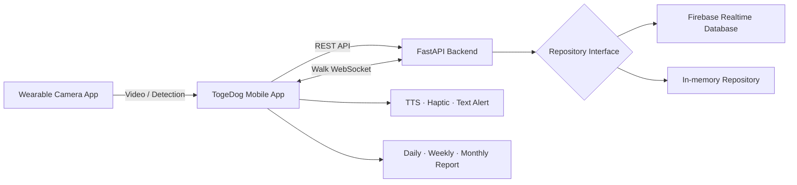

# TogeDog 🐕‍🦺

### 서로를 이해하고, 함께 더 안전한 일상으로

**시각·청각장애인 보호자와 반려견을 위한 양방향 AI 스마트 케어 서비스**

> TogeDog은 반려견 웨어러블 카메라의 전방 영상을 AI로 분석하고, 위험 정보를 사용자의 접근성 모드에 맞춰 음성·진동·텍스트로 전달합니다. 반려견의 산책·생체 데이터는 일간·주간·월간 리포트로 연결됩니다.

## 핵심 가치

| Detect | Translate | Care |
|---|---|---|
| 객체 탐지 모델로 산책 중 위험 요소 감지 | 시각·청각 특성에 맞는 멀티모달 알림 | 산책·위험·생체 데이터를 리포트로 관리 |

## 구현 범위

- Flutter 보호자 앱: 온보딩, 접근성 모드, 홈, 산책, 위험 알림, 리포트, 마이페이지
- Flutter 카메라 앱: 반려견 시점 영상 및 객체 탐지 프로토타입
- FastAPI 백엔드: 회원·반려견·기기·산책·위험·생체·리포트 API
- 실시간 통신: 산책별 WebSocket 위험 이벤트 브로드캐스트
- 저장소 추상화: Firebase Repository와 In-memory Repository 교체 구조
- AI 파이프라인: Roboflow 데이터 수집·병합, 클래스 재매핑, 중복 제거, YOLO 학습·평가
- 최종 학습 결과: 100 epoch 기준 `Precision 0.898`, `Recall 0.841`, `mAP@50 0.888`, `mAP@50–95 0.670`

## System Architecture

## Repositories

| Repository | 설명 |
|---|---|
| [`togedog-mobile`](https://github.com/LG-TogeDog-Project/togedog-mobile) | 보호자용 Flutter 앱과 접근성 인터페이스 |
| [`togedog-camera`](https://github.com/LG-TogeDog-Project/togedog-camera) | 반려견 시점 카메라·객체 탐지 앱 |
| [`togedog-backend`](https://github.com/LG-TogeDog-Project/togedog-backend) | FastAPI, Firebase, WebSocket 기반 API 서버 |
| [`togedog-ai`](https://github.com/LG-TogeDog-Project/togedog-ai) | 객체 탐지 데이터 파이프라인, 학습 노트북, 평가 결과 |
| [`togedog-docs`](https://github.com/LG-TogeDog-Project/togedog-docs) | 서비스 구조, 데이터 모델, API 및 프로젝트 문서 |

## AI 위험 객체 12종

`person` · `stairs` · `dog` · `chair` · `pole_obstacle` · `car` · `bicycle` · `crosswalk` · `traffic_light` · `table` · `scooter` · `motorcycle`

## Project Overview

| 구분 | 내용 |
|---|---|
| 팀 | R3PLAY |
| 과정 | 2026 K-Digital Training · LG전자 DX School 실전역량 프로젝트 |
| 핵심 타깃 | 일반 반려견과 생활하는 시각·청각장애인 보호자 |
| 프로젝트 완료 | 2026.06.25 |
| 팀장 | 김예원 |
| 팀원 | 김주영, 김채원, 신채연, 황병관 |

## Prototype Notice

본 프로젝트는 교육 과정에서 제작한 프로토타입이며 LG전자의 공식 출시 서비스가 아닙니다. ThinQ 연동, 웨어러블 센서, 일부 인증·알림 흐름은 시연 및 가상 연동을 기준으로 구현되었습니다.

## Security

실제 API 키, 비밀번호, 토큰, Firebase 서비스 계정, `google-services.json`, `GoogleService-Info.plist` 및 서명 키는 공개 저장소에서 제외합니다. 로컬 실행 시 각 저장소의 예시 환경설정과 `SECURITY.md`를 확인하세요.
